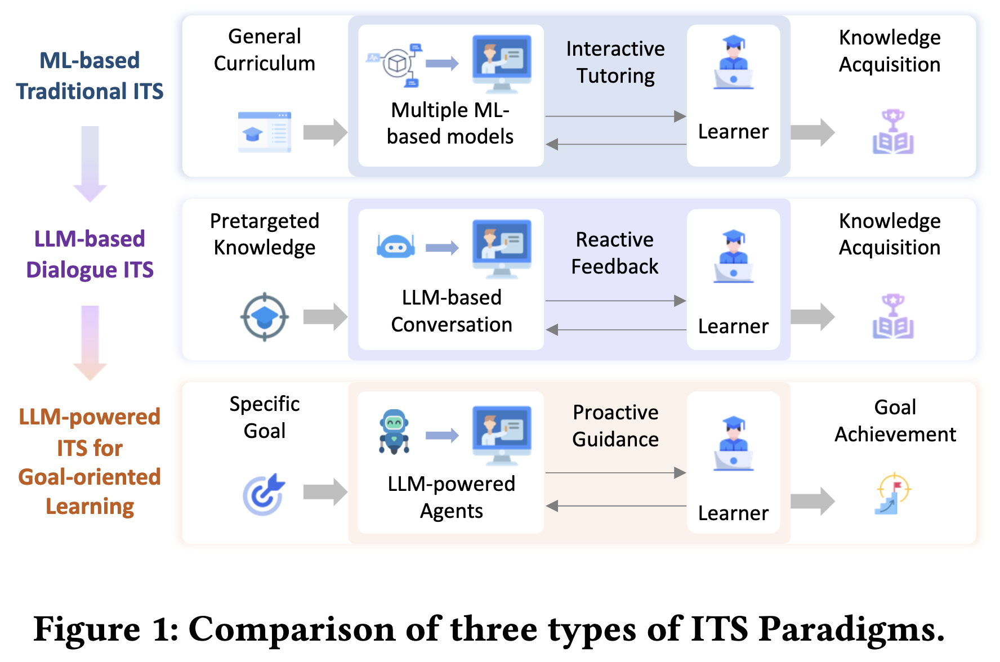
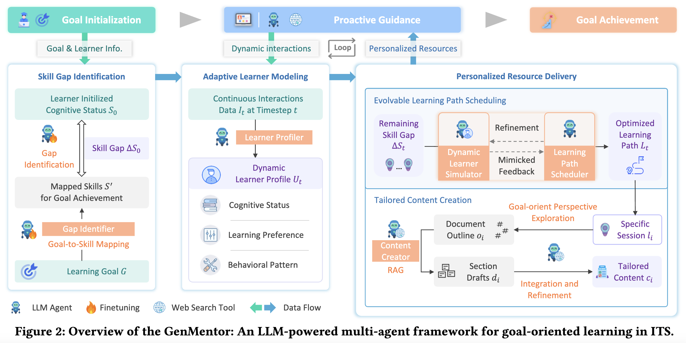
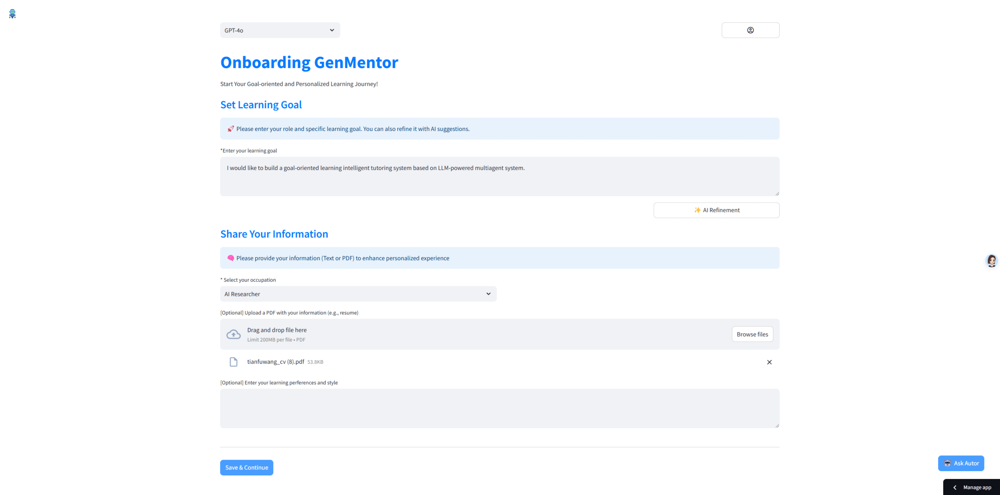
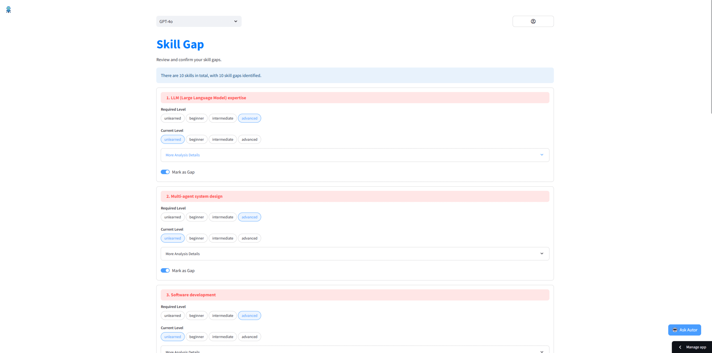
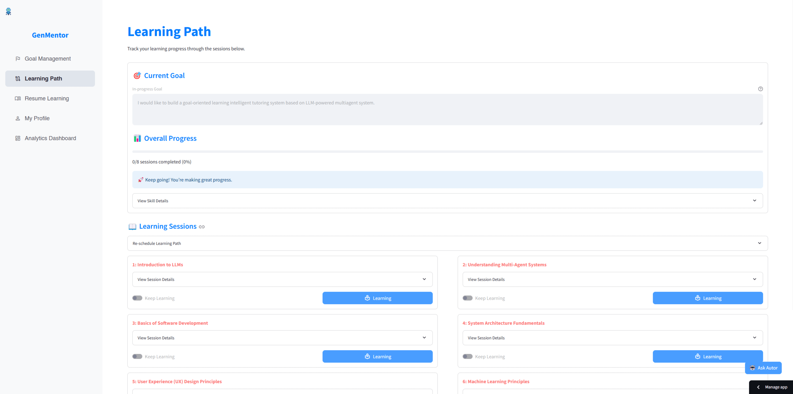
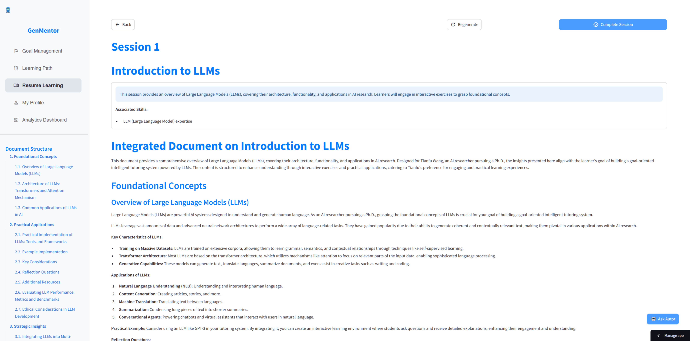
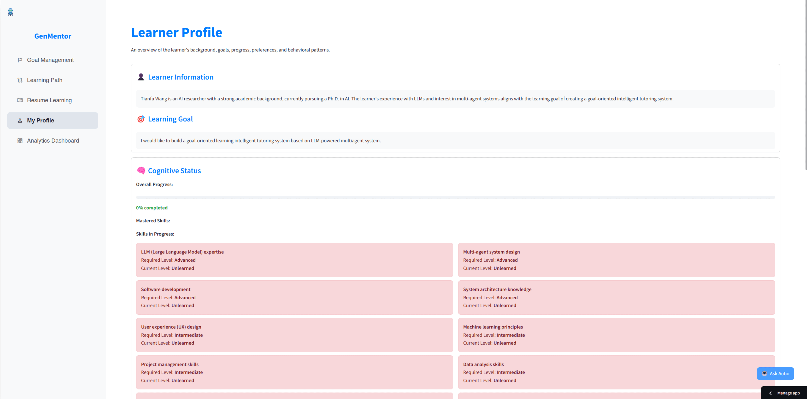

<div align="center">
  <p align="center">
    
  </p>
  <p><b>LLM-powered & Goal-oriented Tutoring System</b></p>

  <p>
    <a href="https://www.tianfuwang.tech/gen-mentor">Website</a> &nbsp;·&nbsp;
    <a href="https://arxiv.org/pdf/2501.15749">Paper</a> &nbsp;·&nbsp;
    <a href="https://gen-mentor.streamlit.app/">Demo</a> &nbsp;·&nbsp;
    <a href="https://youtu.be/vTdtGZop-Zc">Video</a>
  </p>

</div>

---

> [!IMPORTANT]  
> :sparkles: Welcome to visit the [GenMentor website](https://www.tianfuwang.tech/gen-mentor) to learn more about our work!

This is official code of our paper "*LLM-powered Multi-agent Framework for Goal-oriented Learning in Intelligent Tutoring System*", accepted by **WWW 2025 (Industry Track) as an Oral Presentation**.

In this paper, we propose GenMentor, a large language model (LLM)-powered multi-agent framework designed for goal-oriented learning in Intelligent Tutoring Systems (ITS). This framework emphasizes personalization, adaptive learning, and goal-aligned content delivery, making it a robust solution for professional and lifelong learning scenarios.


## 🏫 ITS Paradigm Comparison

<div align="center">
  <p align="center">
    
  </p>
</div>

| Paradigm | Typical characteristics | Primary focus |
|---|---|---|
| 🏫 Traditional MOOC | Static syllabus; pre-recorded lectures; fragmented learning | Broad access, low personalization |
| 🤖 Chatbot ITS | Reactive Q&A; rule/LLM-driven; session-based help | Instant support, limited long-term adaptation |
| 🎯 Goal-oriented ITS | Proactive planning; personalized paths; goal-aligned assessments | Targeted skill acquisition, continual adaptation |


**🤖 Key Agent Modules**

<div align="center">
  <p align="center">
    
  </p>
</div>

- 🧭 `Skill Gap Identifier`: Analyzes learner's current knowledge to identify gaps.
- 👤 `Adaptive Learner Modeler`: Builds and updates learner profiles based on interactions.
- 🗓️ `Learning Path Scheduler`: Creates personalized learning paths and schedules.
- 📝 `Tailored Content Generator`: Produces customized learning materials and assessments.
- 🧑‍🏫 `AI Chatbot Tutor`: Engages learners in dialogue, answering questions and providing support.

**Key Demo Interfaces**

<div align="center">
  <p align="center">
    
    
    
    
    
  </p>
</div>

## 🚀 Quick start

Here, we briefly describe how to set up and run the GenMentor system locally. Please see more details in the respective `backend/` and `frontend/` directories.

### 🛠️ Installation

1. Backend environment setup

```bash
cd backend
uv venv
source .venv/bin/activate  # on Windows: .venv\Scripts\activate
uv pip install -r requirements.txt
```

2. Frontend environment setup

```bash
cd frontend
uv venv
source .venv/bin/activate  # on Windows: .venv\Scripts\activate
uv pip install -r requirements.txt
```

### ⚙️ Configuration

1. Configure LLM secrets (at least one) for backend

*Option A*: update a `.env` file in `backend/`

```plaintext
# Example for OpenAI:
OPENAI_API_KEY="your-openai-api-key"

# Example for DeepSeek:
DEEPSEEK_API_KEY="your-deepseek-api-key"
```

*Option B*: export environment variables in your shell

```bash
# Example for OpenAI:
export OPENAI_API_KEY="your-openai-api-key"

# Example for DeepSeek:
export DEEPSEEK_API_KEY="your-deepseek-api-key"
DEEPSEEK_API_KEY="your-deepseek-api-key"
```

2. Configure api endpoint for frontend

If you would like to run the backend on a different host/port, please update the API URL in `frontend/config.py`:

```python
backend_endpoint = "http://127.0.0.1:5000/"
```

### ▶️ Running Locally

> [!NOTE]
> The default ports are 5000 for backend, 8501 for frontend by default

*Option A*: Manual (preferred when using separate venvs)

```bash
# start backend
cd backend
source .venv/bin/activate  # on Windows: .venv\Scripts\activate
uvicorn main:app --reload --port 5000
```

```bash
# start frontend
cd frontend
source .venv/bin/activate  # on Windows: .venv\Scripts\activate
streamlit run main.py --server.port 8501
```

*Option B*: Helper scripts (single shell; assumes uvicorn/streamlit on PATH)

```bash
# start backend
bash ./scripts/start_backend.sh [PORT]

# start frontend
bash ./scripts/start_frontend.sh [PORT]

# stop all
bash ./scripts/stop_all.sh
```

### 🌐 Accessing the App

Finally, you can access:

- Backend API: http://127.0.0.1:5000/
- Frontend UI: http://127.0.0.1:8501/

## 🚀 Demo Version of Web Application

Welcome to explore the demo version of the GenMentor web application:

[GenMentor Web App](https://gen-mentor.streamlit.app/)

This interactive demo showcases GenMentor's core functionalities, including:

- Skill Gap Identification: Precisely map learner goals to required skills.
- Adaptive Learner Modeling: Capture learner progress and preferences.
- Personalized Content Delivery: Generate tailored learning resources.

You could also watch the demo video for a quick overview (click the image below):

[](https://youtu.be/vTdtGZop-Zc)

## 📚 Citation

```bibtex
@inproceedings{wang2025llm,
  title={LLM-powered Multi-agent Framework for Goal-oriented Learning in Intelligent Tutoring System},
  author={Wang, Tianfu and Zhan, Yi and Lian, Jianxun and Hu, Zhengyu and Yuan, Nicholas Jing and Zhang, Qi and Xie, Xing and Xiong, Hui},
  booktitle={Companion Proceedings of the ACM Web Conference},
  year={2025}
}
```
