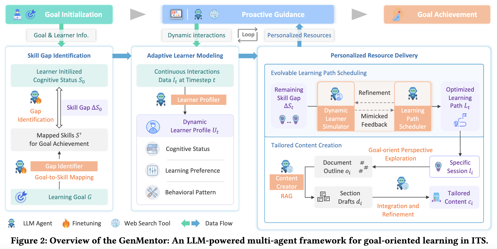
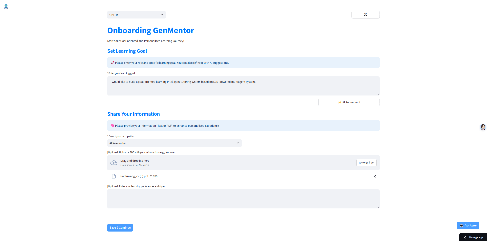
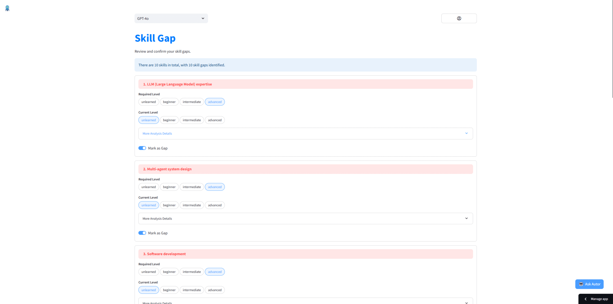
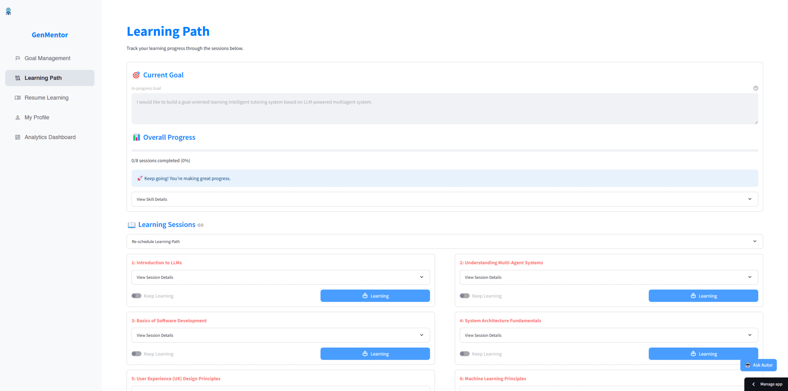
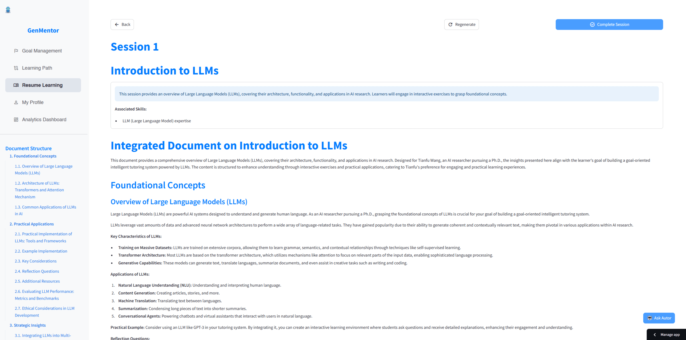
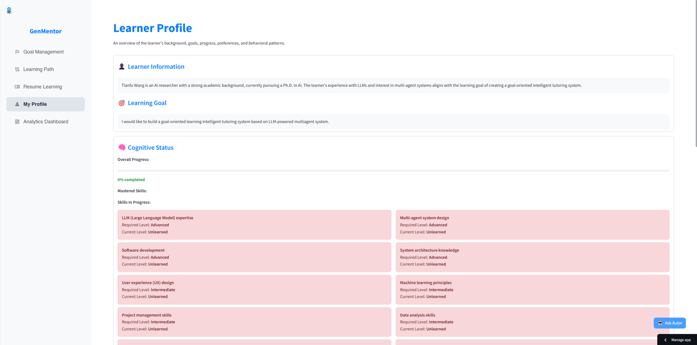

<div align="center">
  <p align="center">
    
  </p>
  <p><b>基于 LLM 的目标导向型个性化学习导师系统</b></p>
</div>

---

**GenMentor** 是一个基于大语言模型（LLM）的多智能体框架，专为目标导向型学习设计。该系统强调个性化、自适应学习和目标对齐的内容交付，为专业学习和终身学习场景提供了一套完整的智能化解决方案。

## 🤖 核心智能体模块

<div align="center">
  <p align="center">
    
  </p>
</div>

- 🧭 **技能差距识别器 (Skill Gap Identifier)**：分析学习者当前的知识水平，精准定位技能差距。
- 👤 **自适应学习者建模器 (Adaptive Learner Modeler)**：基于交互数据构建并实时更新学习者画像。
- 🗓️ **学习路径调度器 (Learning Path Scheduler)**：制定个性化的学习路径和进度安排。
- 📝 **定制化内容生成器 (Tailored Content Generator)**：生成符合用户水平的定制化学习材料和评估测验。
- 🧑‍🏫 **AI 聊天导师 (AI Chatbot Tutor)**：通过对话引导学习者，回答疑问并提供实时支持。

## 🖥️ 演示界面展示

<div align="center">
  <p align="center">
    
    
    
    
    
  </p>
</div>

## 🇨🇳 快速开始（本地运行）

### 1. 环境准备

本系统分为后端（API）和前端（UI）两个部分：

**后端环境配置：**
```bash
cd backend
python -m venv .venv
source .venv/bin/activate  # Windows: .venv\Scripts\activate
pip install -r requirements.txt
```

**前端环境配置：**
```bash
cd frontend
python -m venv .venv
source .venv/bin/activate  # Windows: .venv\Scripts\activate
pip install -r requirements.txt
```

### 2. 参数配置

- **后端密钥**：在 `backend/` 目录下配置环境变量或修改配置文件，设置 `DEEPSEEK_API_KEY`。
- **前端地址**：在 `frontend/config.py` 中确认后端 API 地址：
  ```python
  backend_endpoint = "http://127.0.0.1:5000/"
  ```

### 3. 启动服务

**启动后端：**
```bash
cd backend
python main.py
```

**启动前端：**
```bash
cd frontend
streamlit run main.py --server.port 8501
```

## 🐳 Docker 一键部署（推荐）

本项目支持通过 Docker 和 Docker Compose 快速部署。

1. **配置环境变量**：
   在根目录下创建 `.env` 文件并填入您的 API Key：
   ```plaintext
   DEEPSEEK_API_KEY=your_api_key_here
   ```

2. **一键启动**：
   ```bash
   docker-compose up -d --build
   ```
   启动后访问：
   - 前端界面：`http://localhost:8501`
   - 后端接口：`http://localhost:5000`
   - 搜索服务：`http://localhost:8080` (内置 SearXNG)

## 🌐 联网搜索说明

系统默认开启多级联网搜索回退机制：
1. 优先使用本地部署的 **SearXNG**。
2. 若本地搜索不可用，自动切换至 **DuckDuckGo**。
3. 若联网受限，自动使用本地向量库提供知识保底。

可在 `frontend/config.py` 中修改 `use_web_search` 来切换搜索模式。
